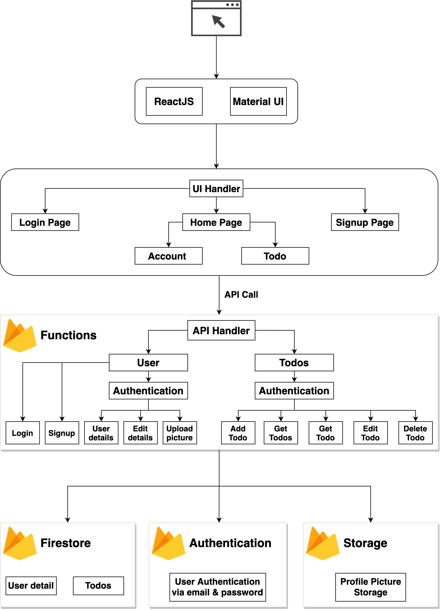

# Todo Application using ReactJS and Firebase

-----

### Account creation:

### Todo Dashboard:

### Application Architecture:

### Components used in the Application:

1. ReactJS
2. Material UI
3. Firebase Firestore, Functions and Authentication
4. ExpressJS
5. Postman.